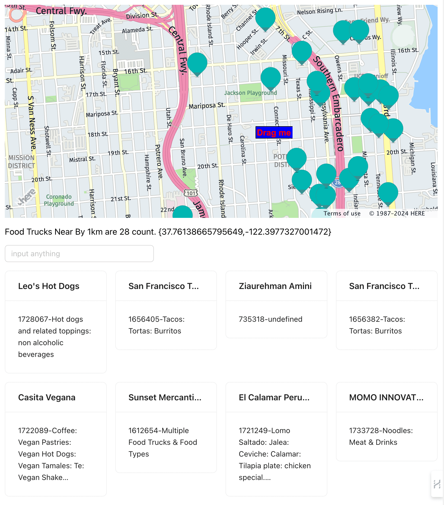

## enginering-mobile-food-facility-permit

[Short Video](https://midu.studio515.cn/resume/food_trucks_geo.mp4){:target="_blank"}.



### Docker Compose

use below docker-compose will startup redis and meilisearch (search engine)

```go

cd backend
docker-compose up -d 
docker ps
    
```
download jdk21 suggest using SDKMan install

use idea to import , than run spring boot application

###  [Backend] Java Spring Boot 3.2 + JDK21

postman 3 apis
```
// fetch the http csv to redis geohash and meilisearch
curl --request GET --url http://localhost:9888/api/trucks

// use redis geohash find near by food trucks
curl --request GET \
   --url 'http://127.0.0.1:9888/api/trucks/nearby?latitude=37.76008693198698&longitude=-122.41880648110114&radius=1'

// use meilisearch for full search every field
curl --request GET \
  --url 'http://127.0.0.1:9888/api/trucks/search?keyword=DRUMM'
```

### [Frontend] React Vite Tailwind HereMaps

```javascript
cd frontend
pnpm i
pnpm run dev
pnpm run build
```


### [Cli] GoLang

```javascript
cd FoodTrucksFinderCLIGolang
go build
./CLIFoodTrucksFinder hot 
```

this is cli result will filter in field applicant and description
```shell

go build
./CLIFoodTrucksFinder 
Error: accepts 1 arg(s), received 0
Usage:
  CLIFoodTrucksFinder [Applicant or LocationDescription character]  [flags]

Flags:
  -h, --help   help for CLIFoodTrucksFinder

accepts 1 arg(s), received 0


./CLIFoodTrucksFinder hot

Input string: hot
Not Found USA CSV, Downloading CSV...
Filtered Data:
[locationid] 1657809,[Applicant] is San Francisco Carts & Concessions, Inc. DBA Stanley's Steamers Hot Dogs,[LocationDescription] is GEARY ST: STOCKTON ST to POWELL ST (200 - 299)
[locationid] 1735285,[Applicant] is El Alambre,[LocationDescription] is 14TH ST: FOLSOM ST to SHOTWELL ST (100 - 150)
[locationid] 1735284,[Applicant] is El Alambre,[LocationDescription] is SHOTWELL ST: 14TH ST to 15TH ST (1 - 99)
[locationid] 946047,[Applicant] is The Huge Hotdog Concession,[LocationDescription] is POLK ST: BUSH ST to AUSTIN ST \ FRANK NORRIS ST (1300 - 1329)
[locationid] 1034228,[Applicant] is Julie's Hot Dogs,[LocationDescription] is MISSION ST: 14TH ST to 15TH ST (1800 - 1899)
[locationid] 1039786,[Applicant] is Julie's Hot Dogs,[LocationDescription] is MISSION ST: 17TH ST to CLARION ALY (2100 - 2131)
[locationid] 948140,[Applicant] is Eli's Hot Dogs,[LocationDescription] is JERROLD AVE: BARNEVELD AVE to JERROLD AVE (2351 - 2369)
[locationid] 1163405,[Applicant] is Julie's Hot Dogs,[LocationDescription] is MISSION ST: 19TH ST to 20TH ST (2300 - 2399)
[locationid] 953198,[Applicant] is Santana ESG, Inc.,[LocationDescription] is SHOTWELL ST: 16TH ST to 17TH ST (200 - 299)
[locationid] 1657803,[Applicant] is San Francisco Carts & Concessions, Inc. DBA Stanley's Steamers Hot Dogs,[LocationDescription] is GEARY ST: GRANT AVE to STOCKTON ST (100 - 199)
[locationid] 1265606,[Applicant] is San Francisco Carts & Concessions, Inc. DBA Stanley's Steamers Hot Dogs,[LocationDescription] is POST ST: STOCKTON ST to POWELL ST (300 - 399)
[locationid] 1010174,[Applicant] is Julie's Hot Dogs,[LocationDescription] is MISSION ST: 19TH ST to 20TH ST (2300 - 2399)
[locationid] 1265597,[Applicant] is San Francisco Carts & Concessions, Inc. DBA Stanley's Steamers Hot Dogs,[LocationDescription] is POST ST: STOCKTON ST to POWELL ST (300 - 399)
[locationid] 1265569,[Applicant] is San Francisco Carts & Concessions, Inc. DBA Stanley's Steamers Hot Dogs,[LocationDescription] is POWELL ST: GEARY ST to POST ST (300 - 399)

```
